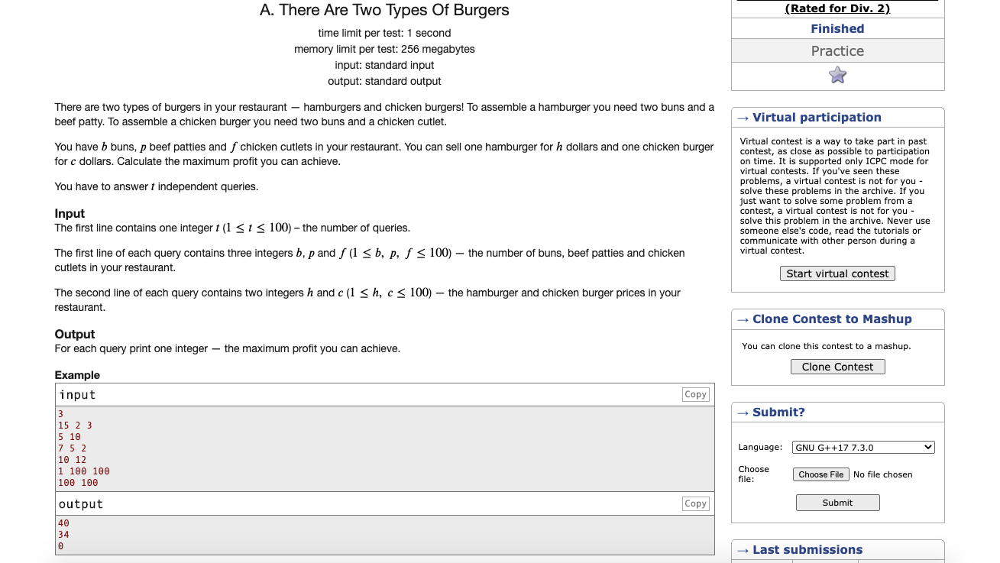

# Codeforces-1207A-There-Are-Two-Types-Of-Burgers
### Problem  

### Program Simulation
* For 1st Test - Case *
<pre>
  b = 15, p = 2, f = 3, h = 5, c = 10

  15 /= 2 // 7
  b = 7

  if(5 < 10 ) condition // true
  swap(h, c)
  h = 10
  c = 5
  swap(p, f)
  p = 3
  f = 2

  res = 0
  cnt = min(7, 3) // 3
  7 -= 3 // 4
  b = 4
  3 -= 3 // 0
  p = 0
  res + 10 * 3 // 30
  res = 30

  cnt = min(4, 2) // 2
  cnt = 2
  4 -= 2 // 2
  b = 2
  2 -= 2 // 0
  f = 0
  res + 5 * 2 // 30 + 10 = 40
  res = 40

  print res 

  Final Output :
  40
 </pre>
 * For 2nd Test - Case *
 <pre>
 b = 7, p = 5, f = 2, h = 10, c = 12

  7 /= 2 // 3
  b = 3

  if(10 < 12) condition //true
  swap(10, 12)
  h = 12
  c = 10
  swap(5, 2)
  p = 2
  f = 5

  res = 0
  cnt = min(3, 2) // 2
  cnt = 2
  3 -= 2 // 1
  b = 1
  2 -= 2 // 0
  p = 0
  res += (12 * 2) // 24
  res = 24

  cnt = min(1, 5) // 1
  cnt = 1
  1 -= 1 // 0
  b = 0
  5 -= 1 // 4
  f = 4
  res += (10 * 1) // 24 + 10 = 34
  res = 34

  print res 

  Final Output:
  34
  </pre>
